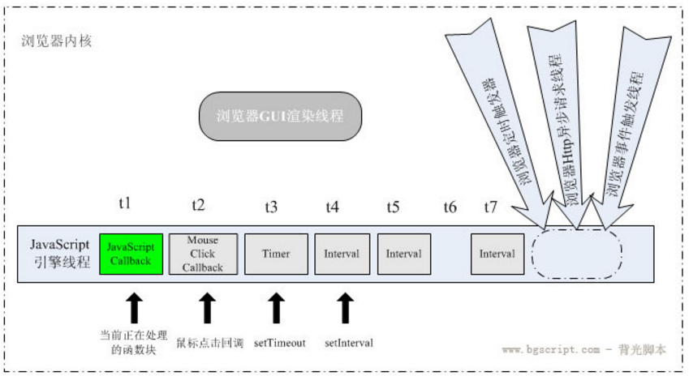
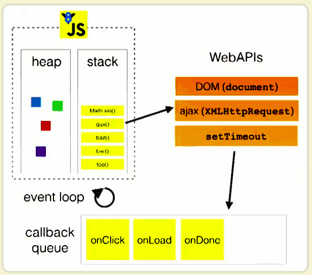

# 异步
一般理解为，与同步处理相对，异步处理不用阻塞当前线程来等待处理完成，而是允许后续操作，直至其它线程将处理完成，并回调通知此线程。
其实，可能不只是线程，可能是不同的进程，不同的服务。  
异步的关键是通讯，涉及两个主体的交互。

# 回调
回调函数就是一个通过函数指针调用的函数。如果你把函数的指针（地址）作为参数传递给另一个函数，当这个指针被用来调用其所指向的函数时，我们就说这是回调函数。
简单理解，函数B 作为参数传递给 函数A，在函数A 内部执行完其他操作后回调 函数B。

回调的本质是 入参为函数。  
回调与异步没有必然关系。  
异步不一定回调，比如：client发送请求给server后，server异步处理，client轮询处理状态进行处理。  
回调也不一定异步，回调本身还是按代码逻辑顺序（不一定是书写顺序）执行的，只有在函数A内部涉及到通讯，函数B 与函数A 不是同一个实体（线程、进程、服务等）执行时，才 **可能** 是 异步回调。

# JS
js本身是单线程执行的，所以js如果想实现异步，普遍采用回调函数编程。  
js的宿主环境（比如浏览器，Node）是多线程的。  
简单理解，js编程时 将耗时的任务（网络请求，定时，时间监听等）写成异步回调的形式，有其他实体（浏览器、server等）去处理耗时任务，在执行完后，回调自己，处理结果。从而实现不阻塞别的任务。

下文主要节选自（[wudipmd CSDN](https://www.cnblogs.com/woodyblog/p/6061671.html)）

js是单线程语言，浏览器只分配给js一个主线程，用来执行任务（函数），但一次只能执行一个任务，这些任务形成一个任务队列排队等候执行，但前端的某些任务是非常耗时的，比如网络请求，定时器和事件监听，如果让他们和别的任务一样，都老老实实的排队等待执行的话，执行效率会非常的低，甚至导致页面的假死。所以，浏览器为这些耗时任务开辟了另外的线程，主要包括http请求线程，浏览器定时触发器，浏览器事件触发线程，这些任务是异步的。下图说明了浏览器的主要线程。

浏览器线程

图片来自popAnt 画得太好，忍不住引过来 （http://blog.csdn.net/kfanning/article/details/5768776）

js一直在做一个工作，就是从任务队列里提取任务，放到主线程里执行。下面我们来进行更深一步的理解。

event loop

图片来自Philip Roberts的演讲《Help, I'm stuck in an event-loop》非常深刻！

我们把刚才了解的概念和图中做一个对应，上文中说到的浏览器为异步任务单独开辟的线程可以统一理解为WebAPIs，上文中说到的任务队列就是callback queue，我们所说的主线程就是有虚线组成的那一部分，堆（heap）和栈（stack）共同组成了js主线程，函数的执行就是通过进栈和出栈实现的，比如图中有一个foo()函数，主线程把它推入栈中，在执行函数体时，发现还需要执行上面的那几个函数，所以又把这几个函数推入栈中，等到函数执行完，就让函数出栈。等到stack清空时，说明一个任务已经执行完了，这时就会从callback queue中寻找下一个人任务推入栈中（这个寻找的过程，叫做event loop，因为它总是循环的查找任务队列里是否还有任务）。
